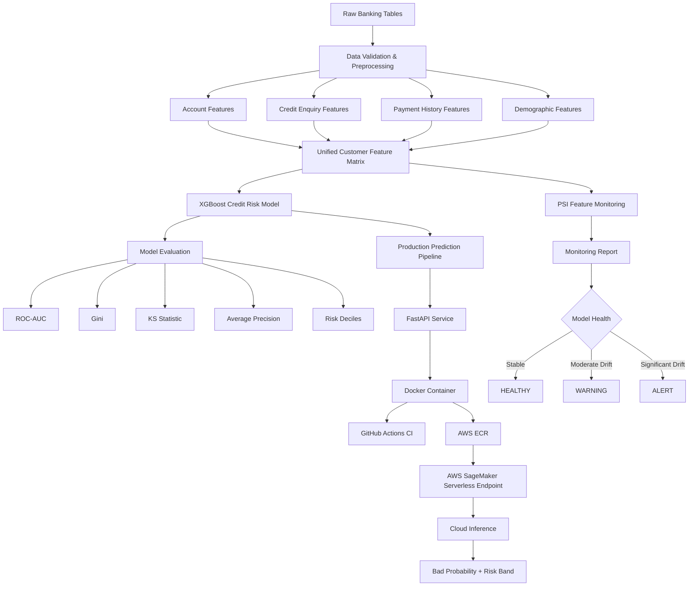
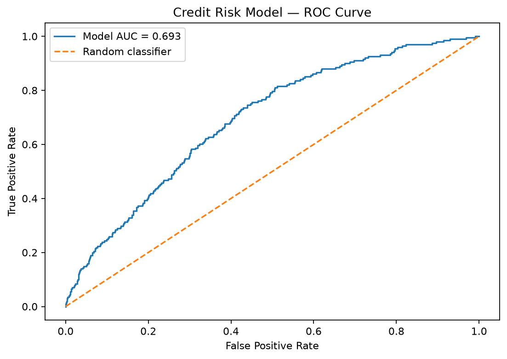
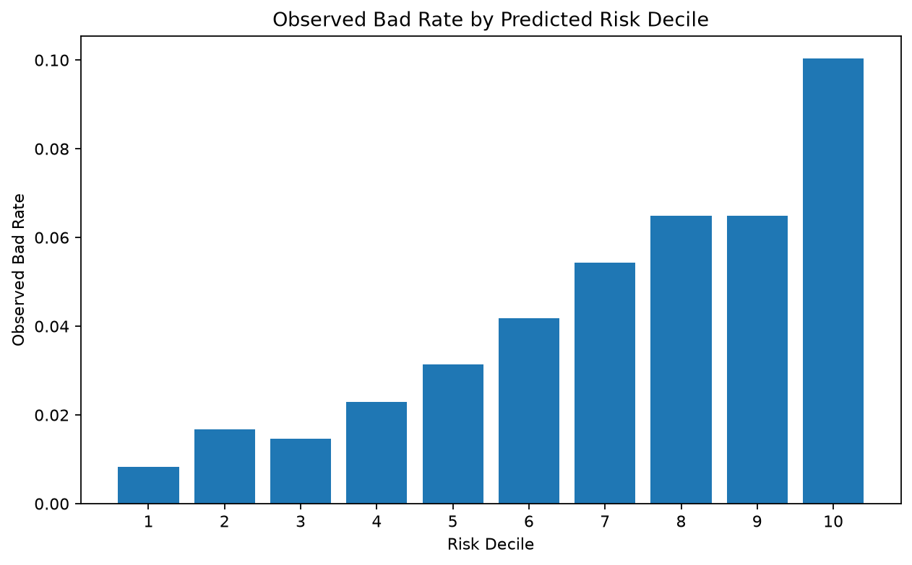
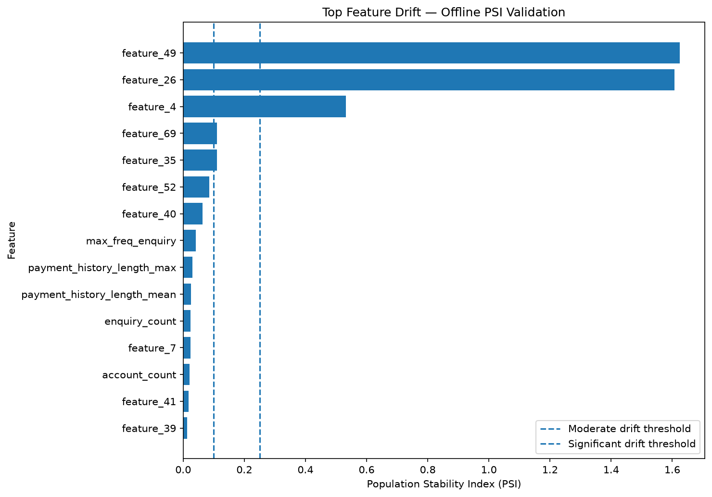

<div align="center">

# 🏦 Bank GoodCredit
## Production Credit Risk ML System

**End-to-End Machine Learning • Credit Risk • MLOps • AWS Deployment • Model Monitoring**


</div>

---

## 🎯 Project Overview

**Bank GoodCredit** is a production-oriented machine learning system for predicting customers at risk of developing a **bad credit history, defined as 30+ Days Past Due (DPD)**.

Rather than stopping at notebook-based modelling, the repository demonstrates a broader ML engineering lifecycle:

```text
Raw Banking Data
        ↓
Data Validation
        ↓
Feature Engineering
        ↓
Customer-Level Feature Matrix
        ↓
XGBoost Credit Risk Model
        ↓
Model Evaluation
        ↓
FastAPI Inference
        ↓
Docker Container
        ↓
GitHub Actions CI
        ↓
AWS SageMaker Serverless
        ↓
Cloud Prediction
        ↓
PSI Drift Monitoring
        ↓
Operational Monitoring Report
```

The goal is to demonstrate how a credit-risk model can move from raw data to a **testable, deployable and monitorable ML service**.

---

## ⭐ Project Highlights

| Capability | Implementation |
|---|---|
| 🏦 Business Problem | Credit-risk / bad-credit prediction |
| 🎯 Target | Customer developing 30+ DPD |
| 🗃️ Data Architecture | Multi-table banking data |
| ⚙️ Feature Engineering | Account, enquiry and payment-history features |
| 🤖 ML Model | XGBoost |
| 📊 Model Evaluation | ROC-AUC, Gini, KS, Average Precision, risk deciles |
| 🚀 Model Serving | FastAPI |
| 📦 Containerization | Docker |
| 🧪 Testing | Pytest |
| 🔄 Continuous Integration | GitHub Actions |
| ☁️ Cloud Deployment | AWS SageMaker Serverless |
| 🔮 Cloud Inference | Successfully executed |
| 📡 Monitoring | Population Stability Index |
| 🚨 Monitoring States | HEALTHY / WARNING / ALERT |
| 📁 Monitoring Evidence | JSON + CSV + visualization |

---

# 🏗️ System Architecture



---

# 🏦 Business Problem

Credit-risk teams need to identify customers whose credit behaviour indicates a higher probability of future delinquency.

The modelling objective is therefore to estimate:

```text
P(Customer develops bad credit behaviour)
```

The model generates a bad-credit probability which can then support downstream risk ranking or risk-band assignment.

Typical business uses include:

- customer risk ranking
- portfolio segmentation
- credit-review prioritization
- early-warning systems
- risk-monitoring workflows

The model is designed as a **decision-support system**, not as an autonomous lending-decision engine.

---

# 🗃️ Data Architecture

The project uses multiple banking-domain tables rather than a single pre-engineered modelling dataset.

The primary information sources include:

```text
Customer Demographics
        +
Customer Accounts
        +
Credit Enquiries
        ↓
Customer-Level Feature Engineering
```

The modular design allows each source to be processed independently before aggregation at customer level.

---

# ⚙️ Feature Engineering

Feature engineering is implemented as separate modules rather than being embedded directly inside model-training code.

```text
src/features/
├── account_features.py
├── enquiry_features.py
├── payment_history.py
└── build_features.py
```

Examples of engineered information include:

- number of customer accounts
- account-history characteristics
- payment-history length
- delinquency-related behaviour
- credit-enquiry frequency
- enquiry amount statistics
- enquiry-purpose diversity
- customer credit-behaviour aggregates

The engineered tables are merged into a **unified customer-level feature matrix**.

This separation makes the feature pipeline easier to maintain, test and extend.

---

# 🤖 Model Development

The modelling layer is separated into training, evaluation and prediction components.

```text
src/models/
├── train.py
├── evaluate.py
└── predict.py
```

The model produces a probability representing estimated bad-credit risk.

The project uses **XGBoost** because tree-based gradient boosting performs well on structured tabular financial data and supports nonlinear relationships between customer attributes and credit behaviour.

---

# 📊 Model Performance

The model evaluation pipeline produces the following stored results:

| Metric | Result |
|---|---:|
| **ROC-AUC** | **0.6925** |
| **Gini Coefficient** | **0.3851** |
| **KS Statistic** | **0.3073** |
| **Average Precision** | **0.0934** |
| Benchmark Gini | 0.3790 |
| **Gini Gap vs Benchmark** | **+0.0061** |

The results are stored in:

```text
reports/metrics/model_metrics.json
```

Credit-risk evaluation is intentionally not based on accuracy alone.

Metrics such as **ROC-AUC, Gini and KS** are useful because they measure how effectively the model ranks customers from lower to higher risk.

---

# 📈 ROC Curve



**ROC-AUC = 0.6925**

The ROC curve measures the trade-off between true-positive and false-positive rates across classification thresholds.

The ROC-AUC is used together with Gini, KS and risk-decile analysis rather than being treated as the only model-performance indicator.

---

# 📉 Risk-Decile Analysis



Credit-risk models are frequently used to **rank customers by risk** rather than making only a binary prediction.

The risk-decile analysis evaluates whether customers receiving higher predicted-risk scores also exhibit higher observed bad rates.

This provides a more business-oriented interpretation of model performance.

---

# 🚀 Production Prediction Pipeline

After model training, a dedicated prediction layer performs customer scoring.

Conceptually:

```text
Customer Features
       ↓
Trained Model
       ↓
Bad-Credit Probability
       ↓
Risk-Band Assignment
       ↓
Prediction Output
```

The model output is separated from training logic so that inference can be reused by local applications, APIs and cloud deployment infrastructure.

---

# 🌐 FastAPI Model Serving

The project exposes the prediction pipeline through a **FastAPI** application.

```text
src/api/
├── __init__.py
└── main.py
```

The API architecture is:

```text
Client Request
      ↓
FastAPI
      ↓
Input Validation
      ↓
Prediction Pipeline
      ↓
Bad Probability
      ↓
Risk Band
      ↓
JSON Response
```

This enables downstream systems to consume model predictions without directly executing Python modelling code.

---

# 📦 Docker Containerization

The model-serving application is containerized using Docker.

Relevant files include:

```text
Dockerfile
.dockerignore
```

Containerization provides:

- reproducible runtime environments
- dependency consistency
- portable model serving
- easier local/cloud deployment
- isolation between application and host environment

---

# 🧪 Automated Testing

The repository contains automated tests covering the production ML components.

```text
tests/
├── test_api.py
├── test_drift.py
└── test_report.py
```

Current test suite result:

```text
13 passed
```

Testing covers:

- API behaviour
- PSI calculation
- drift classification
- handling missing values
- multiple-feature drift monitoring
- monitoring health logic
- monitoring recommendations
- monitoring-report generation
- report persistence

Run the test suite using:

```bash
python -m pytest -v
```

---

# 🔄 Continuous Integration

The project uses **GitHub Actions** for automated CI.

The workflow executes on pushes and pull requests to `main`.

```text
Git Push / Pull Request
        ↓
GitHub Actions
        ↓
Ubuntu Runner
        ↓
Python 3.12
        ↓
Install Dependencies
        ↓
pytest -v
        ↓
CI Result
```

Workflow file:

```text
.github/workflows/ci.yml
```

This introduces automated code verification instead of depending only on manual local tests.

---

# ☁️ AWS SageMaker Deployment

The project includes a dedicated cloud-deployment workflow for **AWS SageMaker Serverless Inference**.

Deployment components include:

```text
sagemaker/
├── deploy.py
├── inference.py
└── requirements.txt
```

A custom SageMaker-compatible inference container is also implemented:

```text
sagemaker_container/
├── Dockerfile
├── requirements.txt
└── app/
    ├── entrypoint.sh
    └── serve.py
```

---

## SageMaker Architecture

```text
Trained Credit Risk Model
          ↓
Model Artifact
          ↓
Custom Docker Image
          ↓
AWS ECR
          ↓
AWS SageMaker Model
          ↓
Serverless Endpoint Configuration
          ↓
SageMaker Serverless Endpoint
          ↓
Cloud Inference
```

---

## SageMaker Configuration

| Component | Configuration |
|---|---|
| Cloud Provider | AWS |
| Hosting Service | SageMaker |
| Endpoint Type | Serverless |
| Region | `us-east-1` |
| Container | Custom inference container |
| Serverless Memory | 2048 MB |
| Maximum Concurrency | 5 |

The deployment code creates the SageMaker model, creates a serverless endpoint configuration and waits for the endpoint to reach `InService`.

---

# ✅ Real Cloud Prediction

The deployed SageMaker endpoint was successfully invoked.

A real prediction response is stored in:

```text
cloud_prediction.json
```

Actual response:

```json
{
  "predictions": [
    {
      "bad_probability": 0.14510737359523773,
      "risk_band": "MEDIUM"
    }
  ]
}
```

This demonstrates the full inference path:

```text
Request
   ↓
AWS SageMaker
   ↓
Custom Inference Container
   ↓
Credit Risk Model
   ↓
Probability Prediction
   ↓
Risk Band
   ↓
JSON Response
```

The cloud-prediction artifact provides evidence that the deployment workflow progressed beyond configuration-only code.

---

# 📡 Production Drift Monitoring

A model can perform well during development while the characteristics of future customers gradually change.

The project therefore implements **Population Stability Index (PSI)** based feature monitoring.

```text
src/monitoring/
├── drift.py
└── report.py
```

The monitoring workflow can be executed through:

```text
scripts/run_monitoring.py
```

---

# 📐 Population Stability Index

PSI compares the distribution of a feature in a reference population with its distribution in a monitoring population.

The implemented thresholds are:

| PSI Range | Status |
|---|---|
| `< 0.10` | `STABLE` |
| `0.10 – < 0.25` | `MODERATE_DRIFT` |
| `>= 0.25` | `SIGNIFICANT_DRIFT` |

The monitoring system evaluates multiple model features independently.

---

# 🕒 Offline Temporal Monitoring Validation

The current monitoring implementation validates the production-monitoring pipeline using **historical project data**.

The data is separated temporally:

```text
Historical Dataset
       ↓
Temporal Ordering
       ↓
70% Reference Population
       +
30% Monitoring Population
       ↓
Feature-by-Feature PSI
```

This is an **offline monitoring validation**, not live production telemetry.

That distinction is intentionally preserved in the generated monitoring report.

---

# 🚨 Real Monitoring Results

The monitoring validation produced:

| Monitoring Metric | Result |
|---|---:|
| **Model Health** | 🚨 **ALERT** |
| Features Monitored | **54** |
| Significant Drift Features | **3** |
| Moderate Drift Features | **2** |
| Highest Drift Feature | `feature_49` |
| Highest PSI | **1.625081** |

The highest-drift features included:

```text
feature_49
feature_26
feature_4
```

The generated operational recommendation was:

> **Significant feature drift detected. Investigate data changes, evaluate model performance and consider retraining before continued production use.**

The monitoring layer deliberately does **not automatically retrain the model** whenever PSI increases.

Feature drift indicates that the population has changed, but does not by itself prove that predictive performance has deteriorated.

---

# 📊 PSI Feature Drift Visualization



The plot provides feature-level visibility into population changes and highlights which model inputs require investigation.

---

# 🩺 Model Health Reporting

Raw statistical outputs are converted into operational model-health states:

```text
HEALTHY
WARNING
ALERT
```

The monitoring report contains information including:

```text
model_health
features_monitored
significant_drift_features
moderate_drift_features
highest_drift_feature
highest_psi
recommendation
```

This layer helps bridge the gap between statistical monitoring and operational ML decision-making.

---

# 📁 Monitoring Artifacts

Executing the monitoring workflow generates reusable artifacts:

```text
reports/
├── figures/
│   ├── roc_curve.png
│   ├── bad_rate_deciles.png
│   └── psi_feature_drift.png
│
├── metrics/
│   └── model_metrics.json
│
└── monitoring/
    ├── monitoring_report.json
    └── psi_feature_drift.csv
```

These results can be consumed by engineers, analysts or future monitoring dashboards.

---

# 🧠 Engineering Decisions

### Modular ML Architecture

Data engineering, feature engineering, model training, evaluation, inference, API serving, monitoring and deployment are implemented as separate modules.

### Production-Oriented Evaluation

Model metrics and plots are persisted as artifacts rather than remaining only inside notebook output.

### Credit-Risk Metrics

ROC-AUC is complemented by:

```text
Gini
KS
Average Precision
Risk-Decile Analysis
```

### API-Based Inference

Model inference can be consumed through FastAPI rather than direct model-file access.

### Containerized Runtime

Docker provides a reproducible deployment environment.

### Automated Tests

Critical serving and monitoring components are validated with Pytest.

### Continuous Integration

GitHub Actions automatically checks the repository on pushes and pull requests.

### Cloud Deployment

The model has been deployed through an AWS SageMaker Serverless workflow.

### Real Cloud Inference Evidence

The repository preserves a real prediction response produced through the cloud inference path.

### Post-Deployment Monitoring

PSI monitoring detects changes in customer-feature distributions.

### Operational Alerting

Statistical monitoring outputs are converted into HEALTHY, WARNING and ALERT states.

---

# 📂 Repository Structure

```text
Bank_GoodCredit_Credit_Risk/
│
├── .github/
│   └── workflows/
│       └── ci.yml
│
├── reports/
│   ├── figures/
│   │   ├── bad_rate_deciles.png
│   │   ├── psi_feature_drift.png
│   │   └── roc_curve.png
│   │
│   ├── metrics/
│   │   └── model_metrics.json
│   │
│   └── monitoring/
│       ├── monitoring_report.json
│       └── psi_feature_drift.csv
│
├── sagemaker/
│   ├── deploy.py
│   ├── inference.py
│   └── requirements.txt
│
├── sagemaker_container/
│   ├── Dockerfile
│   ├── requirements.txt
│   └── app/
│       ├── entrypoint.sh
│       └── serve.py
│
├── scripts/
│   └── run_monitoring.py
│
├── src/
│   ├── api/
│   │   ├── __init__.py
│   │   └── main.py
│   │
│   ├── data/
│   │   ├── ingestion.py
│   │   ├── preprocessing.py
│   │   └── validation.py
│   │
│   ├── features/
│   │   ├── account_features.py
│   │   ├── build_features.py
│   │   ├── enquiry_features.py
│   │   └── payment_history.py
│   │
│   ├── models/
│   │   ├── evaluate.py
│   │   ├── predict.py
│   │   └── train.py
│   │
│   └── monitoring/
│       ├── drift.py
│       └── report.py
│
├── tests/
│   ├── test_api.py
│   ├── test_drift.py
│   └── test_report.py
│
├── cloud_prediction.json
├── Dockerfile
├── model_card.md
├── pyproject.toml
├── requirements.txt
└── README.md
```

---

# 💻 Running Locally

## Clone the Repository

```bash
git clone https://github.com/rc-mathew/Bank_GoodCredit_Credit_Risk.git
cd Bank_GoodCredit_Credit_Risk
```

## Create a Virtual Environment

### Windows

```bash
python -m venv .venv
.venv\Scripts\activate
```

### Linux / macOS

```bash
python -m venv .venv
source .venv/bin/activate
```

## Install Dependencies

```bash
pip install -r requirements.txt
```

---

# 🧪 Run Tests

```bash
python -m pytest -v
```

Expected validated test suite:

```text
13 passed
```

---

# 🚀 Start the API

```bash
uvicorn src.api.main:app --reload
```

The FastAPI application can then serve credit-risk predictions locally.

---

# 📡 Run Drift Monitoring

From the repository root:

```bash
python scripts/run_monitoring.py
```

The workflow produces:

```text
PSI calculations
        ↓
Feature drift classification
        ↓
Model health
        ↓
Operational recommendation
        ↓
JSON / CSV / PNG monitoring artifacts
```

---

# 🛠️ Technology Stack

### Machine Learning

```text
Python
Pandas
NumPy
scikit-learn
XGBoost
```

### API & Serving

```text
FastAPI
Uvicorn
Docker
```

### Testing & CI

```text
Pytest
GitHub Actions
```

### Cloud

```text
AWS
Amazon ECR
Amazon SageMaker Serverless
```

### Monitoring

```text
Population Stability Index
Feature Drift Classification
Model Health Reporting
Automated Monitoring Artifacts
```

### Development

```text
Git
GitHub
VS Code
```

---

# 🔄 Production ML Lifecycle Demonstrated

```text
DATA
 ↓
VALIDATION
 ↓
FEATURE ENGINEERING
 ↓
MODEL TRAINING
 ↓
MODEL EVALUATION
 ↓
RISK SCORING
 ↓
FASTAPI
 ↓
DOCKER
 ↓
AUTOMATED TESTING
 ↓
GITHUB ACTIONS
 ↓
AWS SAGEMAKER
 ↓
CLOUD INFERENCE
 ↓
DRIFT MONITORING
 ↓
OPERATIONAL DECISION
```

The purpose of this repository is therefore not only to demonstrate that a classification model can be trained.

It demonstrates how a credit-risk model can be transformed into a **production-oriented ML system**.

---

# ⚠️ Limitations

This repository is a portfolio implementation and should not be interpreted as a live bank lending-decision system.

The SageMaker deployment demonstrates cloud inference, while the PSI monitoring uses historical data to validate the monitoring architecture rather than live production customer traffic.

A real regulated financial-institution deployment would require additional controls around:

- independent model validation
- fairness and bias assessment
- model explainability
- probability calibration
- decision-threshold governance
- data-quality SLAs
- delayed-label performance monitoring
- security and secrets management
- audit logging
- infrastructure-as-code
- model registry and versioning
- rollback strategies
- regulatory approval

---

# 🔮 Future Improvements

Potential extensions include:

```text
SHAP / model explainability
Probability calibration
Fairness testing
Precision-recall visualization
Performance monitoring with observed outcomes
Cloud monitoring dashboards
Model registry
Infrastructure as Code
Champion / Challenger modelling
Automated retraining with governance approval
```

SHAP is intentionally listed as a **future enhancement rather than a missing requirement**, because the current repository is focused primarily on production engineering, deployment and monitoring.

---

# 🎯 What This Project Demonstrates to an ML Engineer Interviewer

```text
✓ Multi-table banking data engineering
✓ Domain-oriented feature engineering
✓ XGBoost credit-risk modelling
✓ Credit-risk evaluation metrics
✓ Risk-decile analysis
✓ Modular Python architecture
✓ Production prediction pipeline
✓ FastAPI model serving
✓ Docker containerization
✓ Automated testing
✓ GitHub Actions CI
✓ AWS ECR container workflow
✓ AWS SageMaker Serverless deployment
✓ Successful cloud inference
✓ PSI feature-drift monitoring
✓ Operational monitoring reports
✓ Model-health alerting
```

---

# 👤 Author

**Reuben C. Mathew**

Machine Learning • Data Science • FinTech

GitHub: **[@rc-mathew](https://github.com/rc-mathew)**

---

<div align="center">

## ✅ Project Status

### End-to-End Production-Oriented Implementation Completed

**Data → Features → Model → Evaluation → API → Docker → CI → AWS → Cloud Inference → Monitoring**

</div>